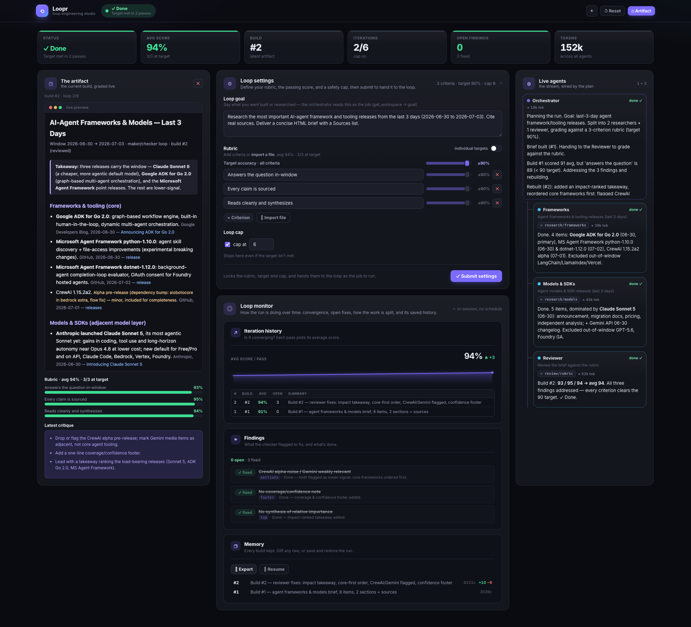

# Loopr

Loopr is a live dashboard for loop engineering. You write down what "good" looks
like as a rubric, a maker builds an attempt, a checker grades that attempt against
your rubric, and the two keep trading passes until every criterion clears the bar
you set. The whole thing plays out on screen as it happens.

Here is the interesting part. In the default mode the backend never calls an LLM.
Your own connected Claude does the work, using its own tools and subscription, and
it pushes results onto the dashboard through the `loopr` MCP server. So anyone
watching sees the loop run live: the orchestrator's output, every subagent it
spawns, the score trend, the open findings, and the graded artifact itself.

If you would rather not drive it by hand, there is an autonomous mode
(`LOOPR_MODE=api`) where the backend runs the maker and checker agents itself on
an Anthropic API key.



## What it feels like to use

1. Open the dashboard and write your **loop goal**: what you want built or researched.
2. Add a **rubric**. Type a few criteria, or import a whole rubric file. Set a
   target score and a safety cap on how many times it may iterate.
3. Press **Submit**. That hands the finished spec to the loop as the job to run.
4. Your connected Claude picks it up, does the work, grades itself honestly against
   the rubric, and iterates until it either hits the target or reaches the cap. You
   watch it converge, pass by pass.

## Quick start

You need Python 3.11 or newer and Node 18 or newer.

```bash
git clone https://github.com/homayounsrp/loopr.git && cd loopr
bash scripts/setup.sh      # backend venv + deps, frontend deps, writes .env
bash scripts/start.sh      # backend on :8000, frontend on :3000
```

Then open http://localhost:3000 (it sends you to the dashboard).

## Connect Claude so it can drive the dashboard

The repo ships a project-scoped `.mcp.json`, so Claude Code finds the `loopr`
server on its own. Open the project folder in Claude Code and approve it when
asked (`/mcp` lists it). It points at the backend on http://localhost:8000.

Prefer to register it by hand, or run it on a different machine or port?

```bash
claude mcp add loopr \
  -e LOOPR_URL=http://localhost:8000 \
  -- ./backend/.venv/bin/python ./backend/app/mcp_server.py
```

On Windows the interpreter lives at `backend\.venv\Scripts\python.exe`, so edit
the `command` in `.mcp.json` to match.

Once it is connected, just tell Claude what you want, something like "research the
last 3 days of AI agent news and land it on the dashboard." Claude reads the job
with `get_workspace`, does the work, and pushes results back with the tools listed
below.

### Auto start on Submit (optional)

Pressing Submit also puts a durable job on the backend. It survives restarts and
reconnects, and it waits there until an orchestrator claims it, so a Submit is
never lost. If you want a connected Claude to pick up every Submit on its own,
point it at the poller:

```bash
python3 scripts/await_job.py     # blocks until you Submit, then claims the job
```

It prints the goal, rubric, target, and cap, and your Claude takes it from there.

### What the MCP server exposes

Reading the job: `get_workspace`, `get_dashboard_state`, `get_section_html`.

Producing and grading: `save_build`, `save_scores`, `save_critique`, `save_findings`.

Live output: `emit_output`, which gives the orchestrator one pane and every
subagent its own.

Planning and control: `set_plan`, `set_gate` (a human checkpoint), `set_schedule`,
`set_agents`.

Configuration: `set_rubric`, `set_target`, `set_loop_cap`, `send_brief` (the goal).

Memory and lifecycle: `export_state`, `resume_state`, `clear_outputs`, `reset`, `stop`.

None of this works unless the backend is running, since the MCP server is a thin
proxy over the backend's REST API.

## How it fits together

Everything smart lives in the Python backend. The frontend is a thin viewer that
streams state over a WebSocket and draws it.

```
backend/app/
  domain/models.py    Pydantic models (Snapshot, EvalResult, Finding, and friends)
  state.py            FactoryState: the shared state, rubric, builds, history, findings, gate, job queue
  engine.py           LooprEngine: applies each push, derives status, broadcasts snapshots
  main.py             FastAPI app, the /ws/factory WebSocket plus the /api/* REST control plane
  mcp_server.py       the loopr MCP server (stdio) that proxies /api/* for a Claude client
  agents/             the maker and checker steps for api mode, plus the LLM client
  sanitize.py         strips <script> out of any pushed HTML
frontend/src/
  lib/types.ts        wire types that mirror the Snapshot
  lib/useFactory.ts   one auto reconnecting WebSocket hook
  app/loopr/page.tsx  the dashboard itself
scripts/
  setup.sh, start.sh  one command setup and run
  dashctl.py          a shell driver for the same REST API, handy when the MCP is not connected
  await_job.py        waits for a Submit and claims the job (the auto start poller)
```

## Configuration

`.env` is created from `.env.example` on first setup. Every value has a sensible
default, so an empty file runs in client mode.

| Variable | Default | What it does |
|---|---|---|
| `LOOPR_MODE` | `client` | `client` means the backend makes no LLM calls and you drive it. `api` means the backend runs the agents itself. |
| `LOOPR_MODEL` | `claude-sonnet-4-6` | the default model in api mode |
| `ANTHROPIC_API_KEY` | unset | only needed in api mode. An OAuth token in `ANTHROPIC_AUTH_TOKEN` works too. |

The frontend talks to `ws://localhost:8000/ws/factory` by default. Override it with
`NEXT_PUBLIC_WS_URL` (and `NEXT_PUBLIC_API_URL` for the REST calls) in
`frontend/.env.local`. The MCP server and `dashctl.py` read `LOOPR_URL`, which
defaults to `http://localhost:8000`.
